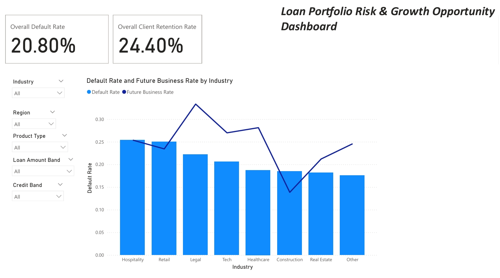

# Loan Portfolio Risk & Growth Opportunity Dashboard

**Overview:**  
This Power BI project analyzes a simulated fintech loan portfolio to assess both risk (default rate) and growth potential (future client retention rate).  

**Key Metrics:**
- **Overall Default Rate** across the entire portfolio
- **Overall Client Retention Rate** (future business rate proxy)

**Dynamic Filters:**
- Industry
- Region
- Product Type
- Loan Amount Band
- Credit Band

**Main Visual:**  
- Combined Bar + Line Chart visualizing Default Rate (bars) and Future Business Rate (line) across industries.

**Purpose:**  
This dashboard simulates how fintech lenders can dynamically evaluate loan portfolio health, identify high-risk clusters, and uncover strategic opportunities to retain and grow client relationships.

**Notes:**  
- All data is simulated for demonstration purposes.
- Created using Microsoft Power BI Desktop.

---

## 📸 Dashboard Preview:

---

### 🚀 Connect with Me:  
[LinkedIn Profile](https://linkedin.com/in/YOUR-LINKEDIN-URL)

---
